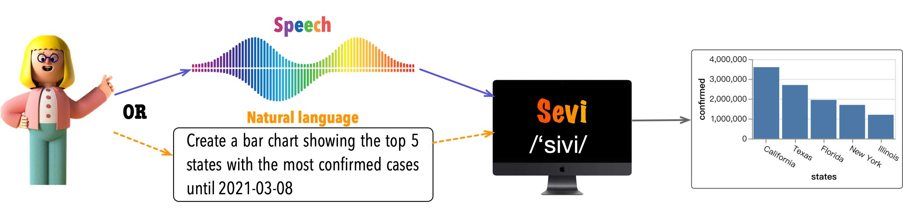
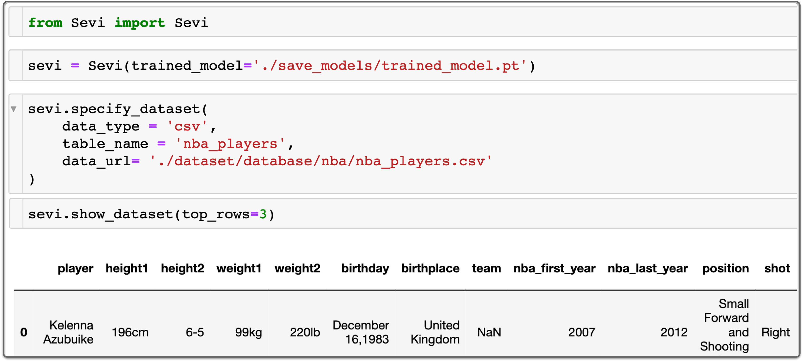
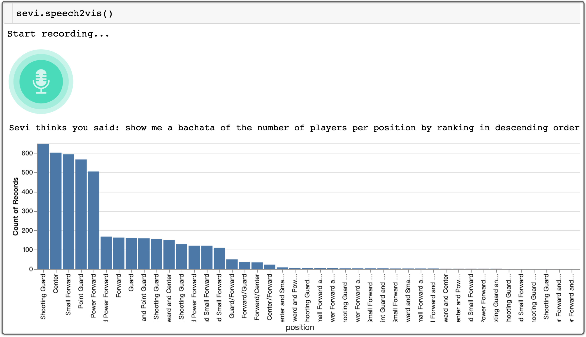

# Sevi: Speech-to-Visualization through Neural Machine Translation

Sevi is an end-to-end data visualization system that acts as a virtual assistant to allow anyone to create visualizations through either natural language or speech.

# Environment Setup

* `Python3.6+`
* `PyTorch 1.7` 
* `torchtext 0.8`
* `ipyvega`

Install Python dependency via `pip install -r requirements.txt` when the environment of Python and Pytorch is setup.

# How to use?

## Data preparation

<!-- * Download [Glove Embedding](xxxxx) and put `glove.6B.100d` under `./dataset/` directory -->

<!-- * [Must] Download the Spider data [here](https://drive.google.com/drive/folders/1wmJTcC9R6ah0jBo_ONaZW3ykx5iGMx9j?usp=sharing) and unzip under `./dataset/` directory -->

* [Optional] **_Only if_** you change the `train/dev/test.csv` under the `./dataset/` folder, you need to run `process_dataset.py` under the `preprocessing` foler. 

## Runing Example

Open the `Sevi.ipynb` to try the running example.

* **NOTE**: The user should configure the [Google Speech-to-Text API](https://cloud.google.com/speech-to-text/docs/libraries). 
the user can send an email to the author to get *Keys*.

## Training

If you want to re-train the model, please run `train.py`.

# Details
## ncNet

Supporting the translation from natural language (NL) query to visualization (NL2VIS) can simplify the creation of data visualizations because if successful, anyone can generate visualizations by their natural language from the tabular data.

We present <b>ncNet</b>, <i>a Transformer-based model for supporting NL2VIS</i>, with several novel visualization-aware optimizations, including using attention-forcing to optimize the learning process, and visualization-aware rendering to produce better visualization results.

### Input and Output

<b>Input:</b> 
* a tabular dataset (csv, json, or sqlite3) 
* a natural language query used for NL2VIS
* an optional chart template 

<b>Output:</b>
* [Vega-Zero](https://github.com/Thanksyy/Vega-Zero): a sequence-based grammar for model-friendly, by simplifying Vega-Lite

Please refer to our [paper](https://github.com/Thanksyy/Vega-Zero/blob/main/ncNet-VIS21.pdf) at IEEE VIS 2021 for more details.

# License
The project is available under the [MIT License](https://github.com/Thanksyy/Vega-Zero/blob/main/README.md).

# Contact
If you have any questions, feel free contact Jiawei Tang (23jtang [AT] asd.edu.qa) or Yuyu Luo (luoyy18 [AT] mails.tsinghua.edu.cn).
